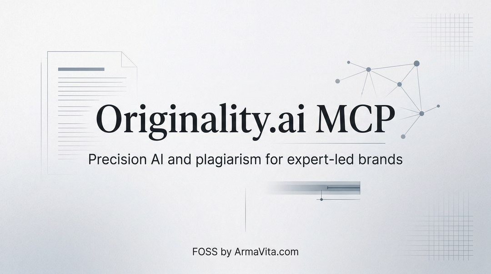

# armavita-originality-ai-mcp

<p align="center">
  
</p>

<a href="https://glama.ai/mcp/servers/@EfrainTorres/armavita-originality-ai-mcp">
  
</a>

<p align="center"><strong>Brought to you by <a href="https://armavita.com">ArmaVita.com</a></strong></p>
<p align="center">Need a custom implementation? <a href="https://armavita.com">Contact us</a>.</p>

`armavita-originality-ai-mcp` is a local-first MCP server for Originality.ai scanning workflows.
It is built for local MCP clients (Claude Code, Cursor, Codex) and supports:

- AI detection, plagiarism, readability, grammar, fact-checking, and SEO scans
- stdio MCP transport only
- Python `>=3.11`
- `mcp==1.26.0`
- License: AGPL-3.0-only

Current contract version: `2.0.0`.

## Install

Package install (enables the `armavita-originality-ai-mcp` CLI):

```bash
pip install -e .
```

Local launcher install (recommended for repo development):

```bash
python3 -m venv .venv
source .venv/bin/activate
pip install -r requirements.txt
```

## Run

```bash
bash ./run.sh
```

Alternative entrypoints:

```bash
python run.py
armavita-originality-ai-mcp
```

## Required Environment Variable

- `ORIGINALITY_API_KEY`: Originality.ai API key used for all API requests.

## Quick MCP Client Config

Canonical server key and path:

```json
{
  "mcpServers": {
    "armavita-originality-ai": {
      "command": "bash",
      "args": ["/absolute/path/to/armavita-originality-ai-mcp/run.sh"],
      "env": {
        "ORIGINALITY_API_KEY": "your_api_key_here"
      }
    }
  }
}
```

## Tool Coverage

- Scanning: `scan_ai`, `scan_full`, `scan_plagiarism`, `scan_readability`, `scan_seo`, `scan_url`
- Retrieval and account: `get_scan_results`, `credit_balance`

## Security

- Never commit real `ORIGINALITY_API_KEY` values.
- Keep credentials in client/server env config, not in source files.

## Development

Quick syntax check:

```bash
python -m py_compile run.py armavita_originality_ai_mcp/server.py armavita_originality_ai_mcp/client.py armavita_originality_ai_mcp/handlers/scan_handlers.py armavita_originality_ai_mcp/tools/scan_tools.py
```

## Docs

- [Contributing](CONTRIBUTING.md)
- [Security Policy](SECURITY.md)
- [Changelog](CHANGELOG.md)

## Scope

- This repository is an OSS local MCP server.
- Transport mode is local `stdio` only.

## License

GNU Affero General Public License v3.0 (AGPLv3). See `LICENSE`.